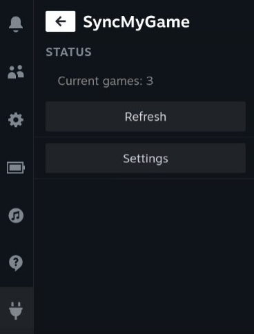

# DeckySyncMyGame

这是一个 Steam Deck 插件，用于将非 Steam 游戏同步到 Steam 游戏库中。

我们建议配合`decky-syncthing`等同步工具使用，方便同步游戏库到 Steam Deck 上。

## 配置游戏库

你需要在每个游戏的启动目录下放置 `.gameinfo.json` 文件，描述相关信息。

```json
{
    "name": "游戏名",
    "title": "显示名，若不填写，使用 name",
    "executable": "可执行文件路径，相对于当前配置文件",
    "directory": "工作路径，相对于当前配置文件",
    "options": "启动选项，例如 WINEDLLOVERRIDES=\"winhttp=n,b\" %command%",
    "compat": "兼容性工具，例如 proton_8",
    "hidden": true
}
```

如果想配置 Icon，放置 `.gameicon.png` 在相同目录。

一个典型的配置如下：

```json
{
    "name": "AGame_v1",
    "title": "AGame",
    "executable": "AGame.exe",
    "directory": "",
    "options": "%command% --graphics=opengl",
    "compat": "proton_8",
    "hidden": false
}
```

## 同步游戏库



在插件菜单中点击同步按钮，即可同步游戏库，默认的，游戏库位于`~/MyGames`，你可以在选项中修改这一路径。

当插件发现`.gameinfo.json`出现改动（包括路径变化），均会重新创建快捷方式。

如果游戏从库中删除（找不到`.gameinfo.json`），插件也会自动删除对应快捷方式。

故，一般的，由插件创建的快捷方式不应当直接从 Steam 库中进行编辑，如果你删除了相应的快捷方式，可以在设置中进行同步，否则对应的快捷方式可能不会被重新创建。
